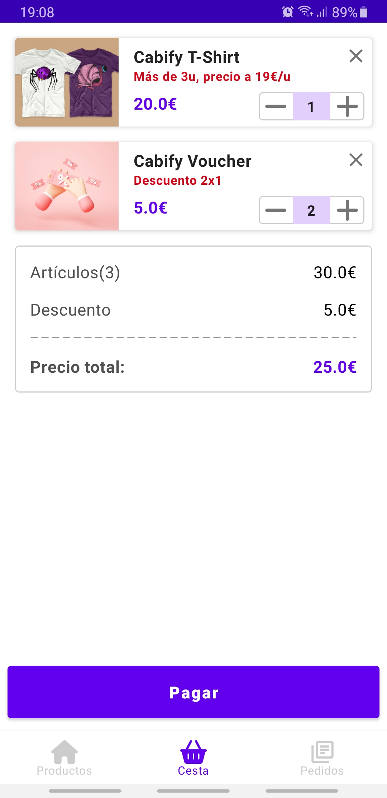

# Cabify Mobile Challenge

Besides providing exceptional transportation services, Cabify also runs a physical store which sells
Products.

Our list of products looks like this:

``` 
Code         | Name                |  Price
-------------------------------------------------
VOUCHER      | Cabify Voucher      |   5.00€
TSHIRT       | Cabify T-Shirt      |  20.00€
MUG          | Cabify Coffee Mug   |   7.50€
```

Various departments have insisted on the following discounts:

* The marketing department believes in 2-for-1 promotions (buy two of the same product, get one
  free), and would like to have a 2-for-1 special on `VOUCHER` items.

* The CFO insists that the best way to increase sales is with discounts on bulk purchases (buying x
  or more of a product, the price of that product is reduced), and demands that if you buy 3 or
  more `TSHIRT` items, the price per unit should be 19.00€.

Cabify's checkout process allows for items to be scanned in any order, and should return the total
amount to be paid.

Examples:

    Items: VOUCHER, TSHIRT, MUG
    Total: 32.50€

    Items: VOUCHER, TSHIRT, VOUCHER
    Total: 25.00€

    Items: TSHIRT, TSHIRT, TSHIRT, VOUCHER, TSHIRT
    Total: 81.00€

    Items: VOUCHER, TSHIRT, VOUCHER, VOUCHER, MUG, TSHIRT, TSHIRT
    Total: 74.50€

# To do

- Implement an app where a user can pick products from a list and checkout them to get the resulting
  price. No need to implement any real payment system, but we do need a nice user experience where
  our customers can understand what items are they purchasing, the price and the discount we are
  applying.
- You should fetch the list of products
  from [here](https://gist.githubusercontent.com/palcalde/6c19259bd32dd6aafa327fa557859c2f/raw/ba51779474a150ee4367cda4f4ffacdcca479887/Products.json)
  .

# Considerations

- Be aware that the discounts are going to change frequently. So the code should support that.
- There is no need for a user login screen.
- Be written as production-ready code. We would like you to build it in the same way as if you were
  going to publish to the store.
- Consider explaning the solution and why certain things are included and others are left out.
- Be written either in Swift or Kotlin, preferably in the latest stable version of the language.
- If possible, use the latest stable version (no Betas) of Xcode or Android Studio.

# Solution

I have solved this challenge with a simple and intuitive design, in which the user is informed at
all times of all the available offers that the products have and the final discount that they get in
total.

The solution is based on 3 main screens, a Modal Bottom Sheet (product detail) and an order
confirmation screen.

The screens are:

1. **Products**: The list of Products is displayed with the offers available for each product and
   the option to see more details about it. In addition, a slider with photos of the available
   products is displayed.

2. **Shopping cart**: A list is displayed with all the products that are currently added to the
   cart. The units of each product are indicated, giving the option to increase, decrease or
   eliminate it from the basket. Also, the offer that each one has available is shown. On this
   screen, a summary of the price of all the items, the price of the total discounts and the total
   price, discounting the price of the discounts, is indicated. On this screen the user is shown the
   Pay button so that he can place his order.

3. **Orders**: A list is displayed with all the orders made, indicating the order number, date,
   order status, number of items purchased and the total price.

4. **Product details**: It is a Modal Bottom Sheet where the product information is displayed,
   including the price and the available offer and a button that indicates in real time if the
   product is in the basket or not, and gives the option of add them to the basket or go to the
   basket in case it is already added.

5. **Order Confirmation**: It is a screen that indicates that the order has been successfully placed
   and automatically redirects to the Products screen.

App screenshots:
<p float="left">
  
   
  
  
  
  
</p>

## Important considerations taken:

The **Strategy** package contains the configuration and logic of the product discount strategies and
new discount strategies can be added, being scalable and maintainable.

Testing: Many unit tests of the application have been carried out, especially of the use cases, but
more things could be tested.

# Architecture

This project has been developed following the Clean Code and Clean Architecture principles and the
good practices set by Google.

* Have a clear separation between layers, as can be seen in the explanation of Modules.
* Decoupling code using dependency injection.
* Use of MVVM design pattern.

### MVVM

In my opinion, it is one of the best architectures to use in an application and have a scalable
application and be able to control the states at all times. BasketShoppingViewModel is a good
example viewmodel to see how it is used in the application.

### Domain

In Domain you will find the definition of the model and the use cases of the application. All Use
Cases make use of coroutines, which run on a thread that stays in the background and returns the
result to the main thread when available.

### Data

In Data there is the repository interface `ProductApiClient` that makes use of Retrofit to make the
calls and makes use of Gson for the analysis of the responses and their subsequent conversion to the
ProductEntity, BasketShoppingEntity and OrdersEntity objects, in addition to the repository
file ` ProductRepository`. There is also the interface of the local BBDD Room and its corresponding
logic and files.

## Libraries

Next, I will explain the libraries that I have used to develop the project:

### Dependency Inversion: [Hilt](https://developer.android.com/training/dependency-injection/hilt-android)

I have used Hilt as dependency injection, because I have worked with it the most before and,
furthermore, it is the one that Google recommends and has the most support from the community.

### Database: [Room](https://developer.android.com/training/data-storage/room)

I have used as Room to store BBDD locally. I use Room on a daily basis and I feel comfortable using
it, that's why I decided to use it in this project.

### Coroutines: [LiveData & Coroutines](https://developer.android.com/kotlin/coroutines?hl=es-419)

I have used them as Coroutines because I think they are wonderful and I really like using them, in
addition, it is essential to be able to manage the requests of the services in the background and
not leave the application blocked to the user. Also, the learning curve is not even close to what it
is with RxJava or RxKotlin.

### Image Loader: [Coil](https://coil-kt.github.io/coil/)

I have used as Coil because it is the one that I usually use all the time.

### Serialization: [Gson](https://github.com/google/gson)

I have used as Gson but I think I am going to change it to [Moshi](https://github.com/square/moshi)
because I think it can be more powerful and is more current.

### Network: [Retrofit](https://github.com/square/retrofit)

I have used as Retrofit because it is the most widely used library for making network calls and it
is the one I have always used in all my projects.

### Functional Programming: [Firebase](https://firebase.google.com/)

I haven't used Firebase because of the size of the project and not to make it too fat, but I have
worked a lot with Firebase, using all its features and the truth is that I really like it and above
all, I feel very safe working with it.

### Testing Mockk and Mockito: [Mockk](https://mockk.io/) [Mockito](https://site.mockito.org/)
I have used Mockk and Mockito for the programming of the test
